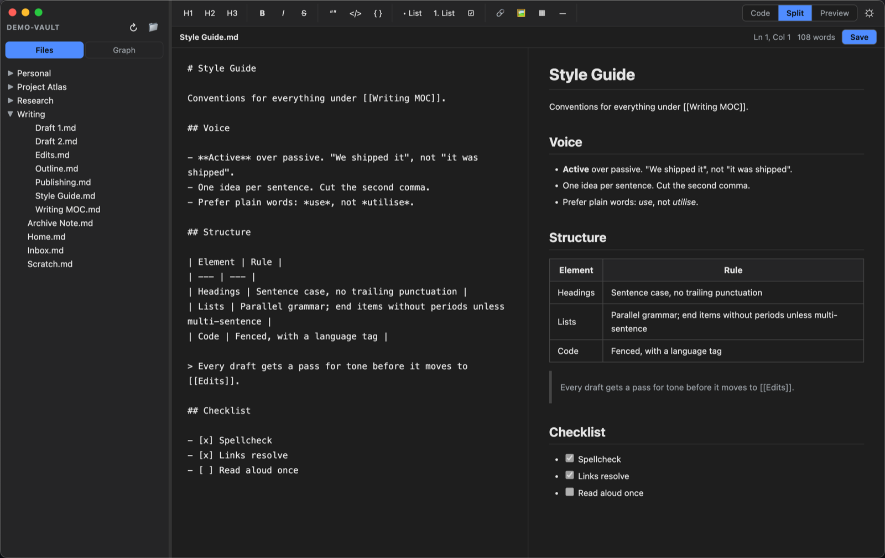
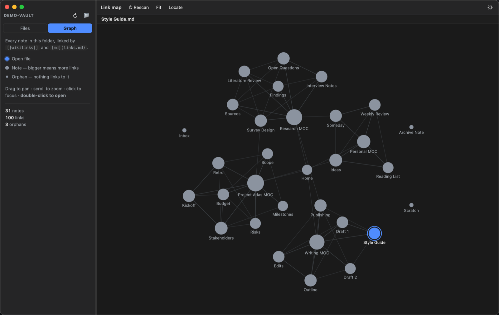

# Markpad

A lightweight, **local-first** Markdown editor built with [Electron](https://www.electronjs.org/).
Write Markdown without memorising the syntax, see a live preview, and navigate your
notes through an Obsidian-style link map.



---

## What it does

Markpad opens a **folder** of `.md` files and gives you three tools over it: an editor
with a button for every Markdown element, a live preview, and a graph that shows how
the files link to each other.

No cloud, no account, no database — your files stay plain `.md` on disk.

## Features

### ✍️ Editor with a toolbar

Every Markdown element has a button, so you never have to remember the syntax:

| Group | Buttons |
| --- | --- |
| Headings | `H1` `H2` `H3` |
| Emphasis | **Bold** · *Italic* · ~~Strikethrough~~ |
| Blocks | Blockquote · inline code · code block |
| Lists | Bulleted · numbered · task list (`- [ ]`) |
| Inserts | Link · image · table · horizontal rule |

Buttons act on the **current selection** and work as a toggle — select text that is
already bold and the button un-bolds it. `Tab` inserts two spaces instead of moving
focus away.

### 👁️ Three views

`Code` (source only) · `Split` (source + preview side by side) · `Preview` (rendered
output only). Switch with the buttons or `Cmd/Ctrl+1 / 2 / 3`.

The preview uses GitHub-flavored Markdown ([`marked`](https://marked.js.org/)) and the
HTML is run through [DOMPurify](https://github.com/cure53/DOMPurify) before it is shown.
It updates as you type.

### 📁 File browser

A tree view of the folder on the left — nested sub-folders that expand on click, lazy
loading, the open file highlighted. Markdown files are visually distinct from the rest.
Hidden files (`.dotfiles`) are skipped.

### 🕸️ Link map



The **Graph** button in the sidebar scans the folder and draws every note as a node,
with edges for the links between them. It recognises:

| Form | Examples |
| --- | --- |
| **Wikilinks** | `[[Note]]` · `[[Note\|alias]]` · `[[Note#heading]]` · `[[folder/Note]]` |
| **Markdown links** | `[text](note.md)` · `[text](../folder/note.md)` · percent-encoded names |

It correctly ignores external URLs, `mailto:`, images, bare anchors (`#section`), and
anything inside inline or fenced code. Duplicate links to the same target count once.
Folders like `node_modules`, `.git` and `dist` are skipped.

**Controls:** drag to pan (or drag a node to rearrange) · scroll to zoom · click to
focus a node and its neighbours · **double-click to open** the file. In the toolbar:
`Rescan`, `Fit` (zoom to fit), `Locate` (centre on the open file).

Node size reflects the number of links · the open file has a blue ring · orphans (no
links at all) appear as small isolated dots. The sidebar shows totals for notes, links,
orphans and broken links.

The graph is written from scratch on a `<canvas>` — a force-directed layout with a
spatial grid, **no external library**. The layout is deterministic, so the same folder
always produces the same map.

### 🌗 Light / Dark theme

Toggle with the button in the top-right or `Cmd/Ctrl+T`. The choice is remembered and
applies to the graph too.

### Smaller things

- **Session restore** — reopens the last folder, file, theme and view.
- **File associations** — double-clicking a `.md` file in Finder / your file manager
  opens Markpad (after installing a package).
- **Status bar** — file name, unsaved-changes indicator, cursor position, word count.
- A prompt before you close a file with unsaved changes.

## Running from source

Requires [Node.js](https://nodejs.org/) 18+.

```bash
git clone https://github.com/cimaz/markpad.git
cd markpad
npm install
npm start
```

Open a specific file: `npm start -- path/to/file.md`

## Packaging

```bash
npm run dist          # macOS + Linux
npm run dist:mac      # macOS  — .dmg + .zip (arm64 & x64)
npm run dist:linux    # Linux  — .deb (amd64 & arm64)
npm run pack          # unpacked build, no installer (quick check)
```

Packages are written to `distro/`. The icon is generated automatically from
[`build/icon.svg`](build/icon.svg) — rendered by Electron itself, so no ImageMagick or
sharp is needed. Configuration: [`electron-builder.yml`](electron-builder.yml).

### Installing the `.deb`

```bash
sudo apt install ./distro/markpad_1.0.0_amd64.deb
```

Installs to `/opt/Markpad` with a desktop entry, hicolor icons and a `.md` file association.

### Note for macOS

The builds are **unsigned** (no Apple Developer certificate). On first launch: right-click
the app → **Open** → **Open**, or run `xattr -cr /Applications/Markpad.app`.

## Keyboard shortcuts

| Keys | Action |
| --- | --- |
| `Cmd/Ctrl` + `N` | New file |
| `Cmd/Ctrl` + `O` | Open file |
| `Cmd/Ctrl` + `Shift` + `O` | Open folder |
| `Cmd/Ctrl` + `S` | Save |
| `Cmd/Ctrl` + `Shift` + `S` | Save as… |
| `Cmd/Ctrl` + `B` / `I` / `E` / `K` | Bold / Italic / Inline code / Link |
| `Cmd/Ctrl` + `1` / `2` / `3` | Code / Split / Preview |
| `Cmd/Ctrl` + `T` | Toggle light / dark |
| `Cmd/Ctrl` + `\` | Show / hide sidebar |

## How it's built

| File | Role |
| --- | --- |
| [`main.js`](main.js) | Electron main process — window, native menu, filesystem IPC, link parsing (`graph:build`) |
| [`preload.js`](preload.js) | Safe bridge (`contextBridge`) + Markdown rendering with `marked` |
| [`src/index.html`](src/index.html) | UI structure |
| [`src/styles.css`](src/styles.css) | Themes (CSS variables) + preview & graph styles |
| [`src/renderer.js`](src/renderer.js) | UI logic — file tree, editor, toolbar, preview, splitter, graph wiring |
| [`src/graph.js`](src/graph.js) | Force-directed link graph on a canvas, no dependencies |

**Security:** `contextIsolation: true`, `nodeIntegration: false`, a strict
Content-Security-Policy, and preview HTML always passes through DOMPurify. The renderer
has no filesystem access — all file operations and link parsing happen in the main
process and are exposed through a narrow API.

Runtime dependencies: only [`marked`](https://marked.js.org/).
[DOMPurify](https://github.com/cure53/DOMPurify) is copied into `src/vendor/` during
`npm install` so it loads under the CSP.

## License

[MIT](LICENSE)
